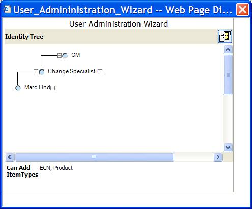

# User Administration Wizard

I am often asked to help resolve Permission issues, especially on implementations that grown over time, and have had several different administrators. I developed a small utility that allows rapid navigation of the Identity hierarchy for a User.

1. Import this Package as Root account (required because it adds an Action to the User itemType).
2. Select a User from the main grid, and right mouse to open the wizard. You can double-click on any node in the Identity hierarchy to open that Identity for modification.
3. In the bottom frame of the Wizard, the list of non-core ItemTypes that this user has Can-Add access to is listed. The itemType names are hyperlinks, and you can click to open the itemType for modification.

Please let me know if this is useful, and what other features could be added to simplify the administration of large user populations and complex permission schemes

## History

This project and the following release notes have been migrated from the old Aras Projects page. Unlike community projects that have been migrated and archived, this project will be updated for compatibility with the latest release of Aras Innovator.

Release | Notes
--------|--------
[v3](https://github.com/ArasLabs/user-admin-wizard/releases/tag/v3) | Version 3 released on 09/18/2007. Removes unused code (functions) in the JavaScript left over from my copy & paste programming practices.

#### Supported Aras Versions

Project | Aras
--------|------
[v3](https://github.com/ArasLabs/user-admin-wizard/releases/tag/v3) | 8.1.1

## Installation

#### Important!
**Always back up your code tree and database before applying an import package or code tree patch!**

### Pre-requisites

1. Aras Innovator installed
2. Aras Package Import tool
3. **com.aras.innovator.solution.userWizard** import package

### Install Steps

1. Backup your database and store the BAK file in a safe place.
2. Open up the Aras Package Import tool.
3. Enter your login credentials and click **Login**
  * _Note: You must login as root for the package import to succeed!_
4. Enter the package name in the TargetRelease field.
  * Optional: Enter a description in the Description field.
5. Enter the path to your local `..\user-admin-wizard\Import\imports.mf` file in the Manifest File field.
6. Select **com.aras.innovator.solution.userWizard** in the Available for Import field.
7. Select Type = **Merge** and Mode = **Thorough Mode**.
8. Click **Import** in the top left corner.
9. Close the Aras Package Import tool.

## Usage

## Contributing

1. Fork it!
2. Create your feature branch: `git checkout -b my-new-feature`
3. Commit your changes: `git commit -am 'Add some feature'`
4. Push to the branch: `git push origin my-new-feature`
5. Submit a pull request

For more information on contributing to this project, another Aras Labs project, or any Aras Community project, shoot us an email at araslabs@aras.com.

## Credits

Created by Peter Schroer, Aras Corporation.

## License

Aras Labs projects are published to Github under the MIT license. See the [LICENSE file](./LICENSE.md) for license rights and limitations.
